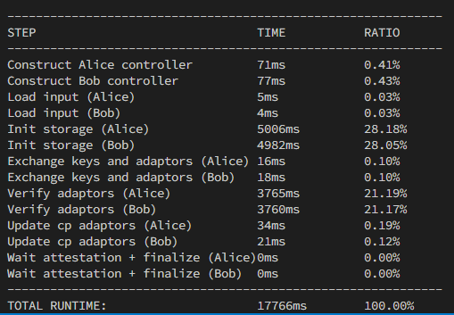
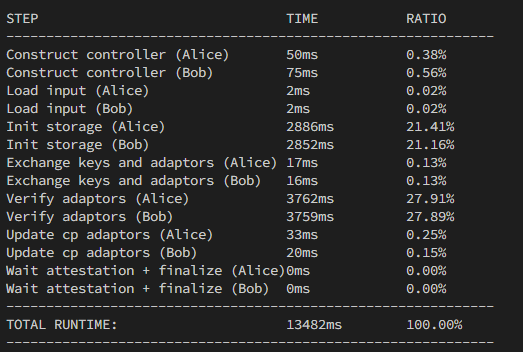

- Main mam non-updated - ale ten sa aj tak bude menit takze je to jedno. [x]
- nemam tu cet_manager - ale to tiez nevadi, pozriem na Mac ak by bolo treba [ ]
- dokumentaciu nemam prekopirovanu [ ]
- dlc_controller je tu len velmi riedky vycuc [x]

[20.2.2025]
Ked opominieme benchmarking `math-bench.rs` ktory by mal sluzit na bench cisto krypto veci, tak __prostredie by malo byt schopne benchmarkovat vsetky sucasti DLC__ (to znamena, ze nase prostredie dovoli benchmarkovat kazdy jeden krok controllera a na zaklade toho sa vieme potom sustredit ze ktora cast stoji za to pozriet sa na nu lepsie a zoptimalizovat ju).
V maine budeme mat (pravdepodobne) 4 typy ktore by sme mali byt schopny menit dle libosti, a to:
1. *AdaptorSignatureScheme* -> ecdsa/schnorr (mala by byt nezavisla)
2. *CryptoUtils* -> simple/basal (tiez nezavisla)
3. *Oracle* -> rand_int resp. lubovolne ine take, ktore si ziada prostredie. -> je zavisle na CryptoUtils kvoli pocitaniu atestacie, inak nezavisle
4. *DlcController* -> tento bude obsahovat DlcComputation a DlcStorage v sebe, pretoze tie 2 su naviazane na DlcController.
5. hypoteticky Parser, ak sa k tomu dostaneme.

Zatial je to vsetko postavene okolo simple-all a basal systemu, tie su vzajomne kompatibilne. Ako to bude s digit-decomposition, to zatial neriesim.

**[25.2.2025]**
Dneska ideme naimplementovat basal crypto utils. Pravdepodobne nam bude treba poprerabat do stavoveho formatu, otazka je kde vsade. Ale kvoli cachingu a precomputed points to potrebne bude.

**(dodatok z datumu 11.3.2025 - malo by to vsak byt ako poznamka niekedy k tomuto casu.)**
Povodne sme mali crypto utils urobene tak, ako to dava zmysel podla paperu _Bitcoin Oracle Contracts: Discreet Log Contracts in Practice_, a to, ze parametre funkcie na vypocet atp_point alebo attestation tak su `oracle_public_key`, `oracle_public_nonce` a `outcome`. pre attestation je tam este private cast. Avsak, kvoli tomu, ze potrebujeme vytvorit stavovy `crypto_utils_engine` kvoli bazickemu pristupu, tak oracle pubkey a pubnonce dame do new a novovytvoreny engine pracuje pre jedno konkretne orakulum. To je vsak ok, len dana funkcia potom nie je bezstavova ale je viazana pre konkretne Oracle.

**[3.3.2025]**
Schnorr pre_signature funguje uz aj v Ruste. Avsak, v C dostavame hodnoty okolo 16μs a v Ruste okolo 30μs. Bolo by fajn zistit, ze preco je to takto. Ako prve sa ponuka pravdepodobne to, ze prechadzame skrz FFI boundary a dostavame tam overhead. Jedno riesenie ktore navrhol Habo bolo take, ze treba pouzit LTO (Link Time Optimization).
Mne vsak napadlo ine riesenie, ktore by bolo fajn skusit spolu s indom, a to by bolo batchovanie presigns. Takymto sposobom crossnem FFI boundary iba raz, v poli mam ulozene messages a atp_points, tie na strane C presignem, a potom crossnem FFI zase iba raz, ale vratim pole s vysledkami. Toto riesenie podla mna je najjednoduchsie co do principu "vela muziky za malo penazi". Let's see...

...
pri compute_anticipation_point v Basis verzii namiesto `combined.combine()` pouzijeme `PublicKey::combine_keys` lebo to spravi scitanie atp_points naraz. Ja si myslim, ze to bude mat suvis s prechadzanim cez FFI. a ze ked dame `combine_keys` tak prejdeme FFI len raz, scitame pole na strane C a potom dostaneme vysledok.

**[9.3.2025]**
Nakoniec sa ukazalo ze FFI pre schnorra problem neni, ale ze problem je to ako mam nastaveny interface pre `AdaptorSignatureScheme`. Ja som ho totiz vytvaral tak, aby odzrkadlovalo popis v "Cryptographic Oracle-Based Conditional Payments", cize pouzivam ako jeden z parametrov Secret Key. Lenze <u>Schnorr adaptor Signature od Inda</u> berie `keypair` ako input parameter do presign. Lenze, kedze ja mam ako input parameter Secret key, znamena to, ze zo secret key musim vyrobit keypair s pomocou funkcie `&signing_key.keypair(SECP256K1)`. No a tato funkcia, sa nakoniec ukazalo, ze zabera ~15µs. To tym padom znamena, ze polovicu casu z nasich 30µs na schnorr presign travime len vytvaranim `keypair`. Ked som urobil potom test priamo iba na `SchnorrAdaptorPreSignature::presign` s priamym pouzitim keypair, tak ta funkcia sa hybala potom okolo 15-18µs, co omnoho viac a presnejsie odraza cca 16µs ktore sme namerali v C. Preto zvolime dalsi postup, ze interface pre `AdaptorSignatureScheme` trochu prerobime, mierne sa odklonime od popisu v paper a namiesto SecretKey tam dame KeyPair. Kedze inde by sme mohli potrebovat SecretKey namiesto Keypair - napr. v ECDSA - tak vsade budeme zas volat z KeyPair funkciu, ktora vyrobi secret key. Toto je vsak zanedbatelne, pretoze ad. 1, keypair obsahuje vsetko na to, aby nemusel nic pocitat a vyslovene vytvarat secret key a ad2. potvrdil nam to aj benchmark, kde som zmeral beh funckie na return secretkey z keypair a rychlost behu je zhruba **1.33ns**. 

**[10.3.2025]**
Spravili sme prvu verziu parsera, aj paralelnu aj seriovu. Zatial bez nejakych extra safety features a error catching, len bare bones. Primarne mi islo o to, zistit, ze kolko casu sa stravi parsovanim vstupu a ze ci je worth the time investovat nejak do toho dalsi cas na optimalizaciu. Uplne prve vysledky ukazuju, ze naparsovat vstup vskutocnosti trva menej nez vytvorit `controller` objekt. Preto nebudeme dalej optimalizovat tuto cast kodu. Je to uplne zbytocne. Akurat to bude treba dotiahnut do poriadneho konca, zeby parser bol aspon ako tak robustny. Dalsia zaujimavost je toto, ze seriovy pristup je rychlejsi nez paralelny. Pravdepodobne overhead v tomto pripade prevysuje samotny efektivny runtime. Parsovanie vstupu robime v kroku `Load input`.
Pozn.: teoreticky, mozno v buducnosti uvidime, ze ak vstup bude komplikovanejsi, tak mozno bude parsovanie trvat dlhsie. Avsak, aktualne je ten cas tak velmi kratky, ze si nemyslim, ze aj keby bol vstup komplexnejsi a vacsi a komplikovanejsi, tak ze to bude mat nejaky razantny dopad na runtime parsovania.

Spravili sme update AdaptorSignatureScheme, a dostali sme skoro dvojnasobne zrychlenie. Nejake milisekundy navyse ze to nedava presne polovicu casu mozu byt sposobene tym, ze sa tam pocita aj atp_point. 

[11.3.2025]
Dlc_computation tak ako aj ine moduly sme spravili povodne modularne aby prostredie bolo rozsiritelne o ine implementacie. Povodne sme mali 2 rozne, parallel a serial, ale kvoli zbytocnej duplicite kodu sme zvolili riesenie take, ze sme tieto dva zjednotili do jedneho a iba kompilacny flag s pouzitim cfg feature rozhodne, ci sa pouzije seriovy alebo paralelny vypocet atp_points a adaptor_signatures.

Pozn.: pravdepodobne feature `parallel` nazveme nejak inak, kvoli tomu, ze parser mame tiez paralelny a ten je ale pomalsi nez seriovy, takze to nechceme spustat obe naraz.

-zmena payout na u64, aby sme vedeli davat vyssie hodnoty nez 40BTC
argumentacia k tomu, preco ktore premenne alebo konstanty mame s nejakymi ciselnymi specifickymi typmi tak je na papieri. (modra hviezdicka)

K `diff` v `parser_out_u32.rs` trochu diskusie. Kedze mooze byt end_payout nizsi ako start_payout (mame klesajuci interval), moze nam vzniknut diff ktory bude zaporny v ramci intervalu. To je vsak vporiadku. Akurat ze, ked urobime rozdiel dvoch unsigned cisel a vyjde nam zaporne (pretoze na reprezentaciu payout pouzivame `u64`), tak nastane overflow a mame error. Jednoduche riesenie by bolo typecastnut end a start payouty do `i64` a odratat ich od seba takto. Lenze, myslienkovym postupom dojdeme k tomu, ze co ak by `end_payout` bol z rozmedzia 2^63 - 2^64 a `start_payout` by bol z rozmedzia < 2^63. To by znamenalo, ze ak by sme toto cislo ulozili do `i64` tak dostaneme nekorektny vysledok, pretoze cisla vacsie ako 2^63 nevieme kvoli znamienku typom `i64` reprezentovat. Preto by sa nukalo riesenie pouzit `i128` a vyhnut sa tomuto problemu. Avsak, ked si uvedomime jednu dolezitu vec, tak nemusime pouzivat ani `i128` ale naozaj staci iba `i64`. To z toho dovodu, ze sice my dokazeme v `u64` reprezentovat cisla az do 2^64, tj cisla vacsie ako 2^63 (ktore ako maximalne vieme reprezentovat v `i64`), lenze v nasom kode tieto hodnoty reprezentuju payout. No a BTC moze byt maximalne 21 000 000. To je na satoshi 21 * 10^14. no a 2^63 je nieco viac nez 9 * 10^18. To znamena, ze aj "vsetky" bitcoiny sa zmestia do 2^63, cize kludne mozeme pouzit typ `i64` na diff. Technicky vacsie cislo dat by slo, ale logicky to nedava zmysel. Mozeme to akurat pripadne osetrit nejakou validaciou vstupu, ze hodnoty nad 21 M BTC budeme brat ako nevalidne.

Nakoniec to teda urobime este trochu inak. `diff` dame najprv na `i64` kvoli nule a potom ho typecastneme na `f64` spolu s interval_len. Podla internetu plati toto:

The maximum finite number for an IEEE 754 double‑precision (f64) is given by
(2−2−52)×21023,
(2−2−52)×21023,

which is approximately 1.7976931348623157e308.

Additionally, f64 has a 53‑bit significand (52 explicit bits plus 1 implicit bit). This corresponds to roughly 15 to 17 decimal digits of precision (typically about 15 decimal digits are reliably preserved).

Cize, kedze 15 cifier dokazeme pomerne spolahlivo reprezentovat floatom 64 bit, tak je to OK, lebo 21M BTC je nieco ako 21 * 10^14 sats.

Takto nam potom vznikne `step` no a step potom mozeme zaokruhlovat na najblizsi integer. Takymto sposobom dostaneme relativne rozumny linearny narast / pokles integer hodnot. Ak by `step` nebol float a nezaokruhlovali by sme, tak by bol problem s tym, ze zvysky by sa nepripocitavali a narast hodnot by potom nebol linearny. Priklad, `len` = 10, `diff` = 12. 12/10 = 1.2. Keby ze mame `step` integer, tak je to 1 a k payout 11 a 12 by sme sa ani nedostali. Ked vsak budeme zaokruhlovat float, tak to bude pomerne linearne.
Pozn.: jediny problem robia hodnoty x.5, tam to bude vzdy trochu neferove voci jednej alebo druhej strane - podla toho, ako budeme zaokruhlovat. Je to vsak stale ferovejsie, nez nezaokruhlovat vobec a pouzivat iba integer `step`.